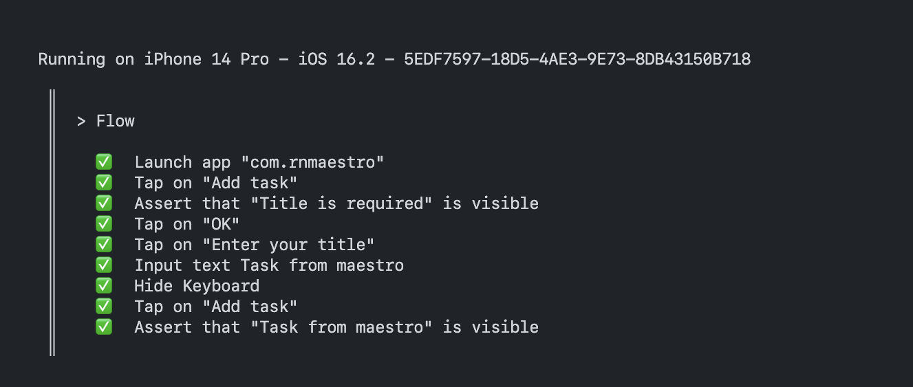

# Kiểm thử ứng dụng di động dễ dàng hơn với Maestro

|  | 
|:--:| 
| *Maestro Twitter Example - maestro.mobile.dev* |


Tôi đã từng sử dụng [Detox](https://wix.github.io/Detox/) để kiểm thử các ứng dụng viết bằng React Native. Tại thời điểm đó Detox khá "hịn" và bá đạo, tiết kiệm được cả khối thời gian cũng như công sức của đội dev và đội kiểm thử. Tuy nhiên sau này, tôi thấy độ phức tạp, cũng như độ "khó" với các thành viên mới trong team, đó là thời điểm **Maestro** đến với tôi như một vị cứu tinh. "Xạo quần" tí thôi chứ tôi biết Maestro qua một bài viết trên trang [dev.to](https://dev.to/), nhưng team tôi "gà" là sự thật 😂.


### Nội dung:
* [Maestro là cái gì ?](#maestro-là-cái-gì)
* [Cài đặt môi trường và dự án React Native](#cài-đặt-môi-trường-và-dự-án-react-native)
* [Cài đặt Maestro](#cài-đặt-maestro)
* [Mô tả các bước kiểm thử](#mô-tả-các-bước-kiểm-thử)
* [Maestro studio](#maestro-studio)
* [Test case](#test-case)
* [Kiểm tra phần tử bằng testID](#kiểm-tra-phần-tử-bằng-testid)
* [Sử dụng biến](#sử-dụng-biến)
* [runFlow](#runflow)
* [Quay màn hình](#quay-màn-hình)
* [Tags](#tags)
* [Kiểm thử trên cloud](#kiểm-thử-trên-cloud)


## Maestro là cái gì ?

Tóm cái váy lại, [Maestro](https://maestro.mobile.dev/) là một framework giúp kiểm thử giao diện người dùng (UI) đơn giản và hiệu quả. Maestro dựa trên ý tưởng từ những người đàn anh đi trước như: Appium, Espresso, UIAutomator, XCTest. Sự khác biệt chủ yếu ở đây là Maestro viết kiểm thử theo dạng Flows.

Flows là gì? Nôm na, Flows sẽ giống như một hành trình đi tìm ánh sáng phía cuối con hẻm cụt, đi từng bước từng bước qua những ngôi nhà, các bước kiểm thử được viết trong file `yaml` hoặc `yml`. Nó giống như việc ta ra lệnh cho máy biết phải làm gì và kiểm tra gì. Đọc thêm tại [Why Maestro?](https://maestro.mobile.dev/#why-maestro).

Maestro hỗ trợ các nền tảng như:

| Platform     | Support |
|--------------| --------|
| iOS          | ✅ |
| Android      | ✅ |
| React Native | ✅ |
| Flutter      | ✅ |
| Web Views    | ✅ |

Cá nhân tôi rất thích sử dụng Maestro cho kiểm thử ứng dụng di động. Quá trình cài đặt, viết kiểm thử cũng hết sức dễ dàng với tất cả những ai chưa biết sử dụng máy tính Casio FX-570.
Trong ví dụ này, tôi sẽ hướng dẫn các bạn cài đặt và viết một vài test case phổ biến. Tôi sử dụng Mac OS và ứng dụng đơn giản viết bằng React Native.


## Cài đặt môi trường và dự án React Native

Đầu tiên, tất nhiên là bạn phải có ứng dụng cần kiểm thử rồi. Để tạo dự án React Native có thể tham khảo các bước đầy đủ tại [Setting up the development environment](https://reactnative.dev/docs/environment-setup).

Giả sử bạn đã có môi trường, tiến hành khởi tạo ứng dụng:

```sh
npx react-native init RNMaestro
```

Sau khi khởi tạo xong bạn để ý **applicationId** của Android (`android/app/build.gradle -> applicationId`) và iOS (`Dự án trong Xcode -> Tab General -> Bundle Identifier`). Bạn có thể tuỳ ý chỉnh sửa chúng để sử dụng sau này, trong hướng dẫn này tôi chỉnh sửa Android và iOS thành `com.rnmaestro`.

Tại file `App.tsx` của dự án, bạn copy & paste đoạn code phía dưới.

```js
// App.tsx
import React, { useState } from 'react';
import { Alert, SafeAreaView, TextInput, Button, FlatList } from 'react-native';

const TASKS = Array.from({ length: 25 }, (_, i) => ({ title: 'Task ' + i }));

interface Item {
  title: string;
}

const App = () => {
  const [title, setTitle] = useState('');
  const [tasks, setTasks] = useState(TASKS);

  const addTask = () => {
    if (title?.trim()?.length === 0) {
      Alert.alert('Title is required');
    } else {
      const newTasks = [...tasks];
      newTasks.unshift({ title });
      setTasks(newTasks);
      setTitle('');
    }
  };

  const renderItem = ({ item }: { item: Item }) => (
    <Button title={item?.title} onPress={() => Alert.alert(item?.title)} />
  );

  const keyExtractor = (item: Item, idx: number) => `${idx}`;

  return (
    <SafeAreaView>
      <TextInput
        value={title}
        placeholder="Enter your title"
        onChangeText={setTitle}
      />
      <Button testID="btn_add_task" title="Add task" onPress={addTask} />
      <FlatList
        data={tasks}
        renderItem={renderItem}
        keyExtractor={keyExtractor}
      />
    </SafeAreaView>
  );
};

export default App;
```


## Cài đặt Maestro

Thông tin cài đặt cho Windows hoặc chi tiết các môi trường khác, vui lòng xem thêm ở tài liệu chính gốc [Installing Maestro
](https://maestro.mobile.dev/getting-started/installing-maestro).

Cài đặt trên Mac OS, Linux:

```sh
curl -Ls "https://get.maestro.mobile.dev" | bash
```

Kiểm tra xem em hàng đã cài đặt thành công hay chưa:

```sh
maestro -v
```

Nếu thấy trả về các số dạng `vi.xxx.com` (ví dụ: 1.27.0) là đã thành công!
Trong trường hợp máy báo `zsh: command not found: maestro`, hãy tắt terminal đi rồi mở lại.

Để chạy trên máy ảo của **iOS**, cần cài đặt thêm [Facebook IDB](https://fbidb.io/):

```sh
brew tap facebook/fb
brew install idb-companion
```

> * Xcode khuyên nên dùng các phiên bản từ 14 trở nên.
> * Một tin chẳng mấy vui, hiện tại Tháng Năm 2023 Maestro chưa hỗ trợ chạy trên máy thật.

Sau khi hoàn thành xong các bước trên là đã xong phần cài đặt. Bắt đầu vào phần viết test case kiểm thử.

<p align="center">
  
<p>


## Mô tả các bước kiểm thử

Dựa vào chức năng của ứng dụng hiện tại, sẽ có một vài bước như sau:

1. Mở ứng dụng lên
2. Nhập `title`
3. Kiểm tra có nội dung không
4. Nhấn nút `Add task`
5. Kiểm tra task mới đã có chưa
6. Nội dung `TextInput` đã được xoá chưa


## Maestro studio

Để cho nhanh chóng lấy được của phần tử trong ứng dụng, ta có thể sử dụng **Maestro studio** để xem chi tiết, cũng như xem được Commands gợi ý.

```sh
maestro studio
```

Sau khi chạy lệnh trên maestro sẽ mở một tab trên browser, mặc định sẽ là `http://localhost:9999`.

https://user-images.githubusercontent.com/30563960/236864010-3700e3c4-9fb8-4cee-bf59-b2755b3ae273.mp4


## Test case

Tại thư mục gốc của dự án, tôi tạo file với đường dẫn `.maestro/app.yaml`.

```yaml
# .maestro/app.yaml
appId: com.rnmaestro # applicationId
---
- launchApp
# Kiểm tra hiện thông báo "Title is required"
- tapOn: "Add task"
- assertVisible: "Title is required"
- tapOn: "OK"

# Kiểm tra thêm task
- tapOn: "Enter your title"
- inputText: "Task from maestro"
- hideKeyboard # Lưu ý 1
- tapOn: "Add task"
- assertVisible: "Task from maestro"
```

> **Lưu ý 1**:
> Trên iOS `hideKeyboard` có thể không ẩn được bàn phím, do vậy tài liệu hướng dẫn khuyên nên dụng `tapOn` nhấn ra ngoài để có thể tắt được bàn phím. Xem thêm [iOS implementation caveat](https://maestro.mobile.dev/api-reference/commands/hidekeyboard#ios-implementation-caveat).

Để chạy file test case tôi sử dụng lệnh:

```sh
# Chạy 1 file duy nhất
maestro test .maestro/app.yaml
# hoặc
# Chạy nhiều file trong thư mục
maestro test .maestro
```

https://user-images.githubusercontent.com/30563960/236864158-dbf562bc-1a98-4352-972a-e16ff68b8f3b.mp4

Kết quả sẽ như sau ở terminal:

<p>
  
<p>

Để tự động chạy kiểm thử lại mỗi khi có thay đổi, bạn có thể chạy test với câu lệnh:

```sh
maestro test -c .maestro/app.yaml
```

Xem thêm các câu lệnh kiểm thử: [Maestro - Commands](https://maestro.mobile.dev/api-reference/commands).

### Kiểm tra phần tử bằng `testID`

Trong ví dụ ở trên tôi đã hướng dẫn viết Flows bằng cách gọi trực tiếp vào các nội dung có trong màn hình. Tuy nhiên sẽ có nhiều phần kiểm thử có nội dung thay đổi sau mỗi lần thao tác, do đó bạn cần phải sử dụng `testID` để xác định. Ví dụ: [View](https://reactnative.dev/docs/view#testid), [Button](https://reactnative.dev/docs/button#testid), [Text](https://reactnative.dev/docs/text#testid), [Image](https://reactnative.dev/docs/image#testid).

Ví dụ:

```yaml
# .maestro/app.yaml
appId: com.rnmaestro # applicationId
---
- launchApp
# Kiểm tra hiện thông báo "Title is required"
- tapOn:
    id: "btn_add_task" # testID ở đây
- assertVisible: "Title is required"
- tapOn: "OK"
```


### Sử dụng biến

Trong trường hợp cần truyền các biến từ bên ngoài vào file Flows `yaml`, ta có thể truyền theo dạng qua các tham số:

```sh
maestro test -e APP_ID=com.rnmaestro .maestro/app.yaml
```

Tại các vị trí sử dụng theo cú pháp `${name}`:

```yaml
# .maestro/app.yaml
appId: ${APP_ID} # applicationId
---
- launchApp
```

Nếu như có quá nhiều biến cần khai báo, ta có thể viết toàn bộ vào key `env` trước dòng `---`:

```yaml
# .maestro/app.yaml
appId: ${APP_ID} # applicationId
env:
  APP_ID: com.rnmaestro
---
- launchApp
```

Bạn muốn chạy kiểm thử từ `scripts` của `package.json` có thể config:

```json
{
  "scripts": {
    "test": "$HOME/.maestro/bin/maestro test",
    "test-dev": "yarn test -e APP_ID=com.rnmaestro.dev",
    "test-prod": "yarn test -e APP_ID=com.rnmaestro"
  }
}
```

* `com.rnmaestro.dev`: dành cho môi trường dev
* `com.rnmaestro`: dành cho môi trường production

Chạy kiểm thử:

```sh
yarn run test-dev .maestro/app.yaml
```


### runFlow

Nếu như bạn không muốn bị trùng lặp các bước, phải viết đi viết lại 1 đoạn kiểm thử nào đó, bạn có thể sử dụng `runFlow` để thực thi một luồng khác. Ví dụ:

```yaml
# Login.yaml
appId: com.example.app
---
- launchApp
- tapOn: Username
- inputText: Test User
- tapOn: Password
- inputText: Test Password
- tapOn: Login
```

```yaml
# Settings.yaml
appId: com.example.app
---
- runFlow: Login.yaml # Chạy kiểm thử từ file `Login.yaml`
- tapOn: Settings
- assertVisible: "Switch to dark mode"
```

Xem thêm tại [Maestro - runFlow](https://maestro.mobile.dev/api-reference/commands/runflow).


### Quay màn hình

Để quay lại quá trình kiểm thử tôi sử dụng lệnh:

```sh
maestro record .maestro/app.yaml
```

Sau khi quá trình kiểm thử hoàn tất, maestro sẽ xuất ra một video định dạng `mp4` ghi lại toàn bộ quá trình.


## Tags

Trong trường hợp bạn chỉ kiểm thử (`--include-tags`) hoặc loại bỏ (`--exclude-tags`) những file nào đó, bạn có thể sử dụng tags. Ví dụ tôi có 2 file:

```yaml
# flowA.yaml
appId: com.example.app
tags: 
  - dev
  - pull-request
```

```yaml
# flowB.yaml
appId: com.example.app
tags: 
  - dev
```

Một số kịch bản sẽ như sau:

* Chạy `--include-tags=dev`, flowA và flowB sẽ chạy.
* Chạy `--include-tags=dev,pull-request`, cả 2 file sẽ chạy.
* Chạy `--exclude-tags=pull-request`, chỉ flowB chạy.
* Chạy `--exclude-tags=dev` không file nào chạy.
* Chạy `--include-tags=dev --exclude-tags=pull-request`, chỉ flowB chạy.

Xem thêm [Maestro - Tags](https://maestro.mobile.dev/cli/tags).


## Kiểm thử trên cloud

Ta có thể chạy Maestro Flows trên cloud qua tài liệu [Maestro Cloud Documentation](https://cloud.mobile.dev/).

Maestro Cloud hỗ trợ các nền tảng CI như:

| CI Platform    | Support via CLI | Native Intergation |
|----------------|-----------------|--------------------|
| GitHub Actions | ✅ | ✅ |
| Bitrise        | ✅ | ✅ |
| Bitbucket      | ✅ | ✅ |
| CircleCI       | ✅ | ✅ |
| GitLab CI/CD   | ✅ | 🚧 |
| TravisCI       | ✅ | |
| Jenkins        | ✅ | |
| Tất cả các nền tảng CI khác | ✅ | |


## Tham khảo thêm

* Maestro: [https://maestro.mobile.dev/](https://maestro.mobile.dev/)
* Maestro Cloud: [https://cloud.mobile.dev/](https://cloud.mobile.dev/)
* Facebook IDB: [https://github.com/facebook/idb](https://github.com/facebook/idb)
* Best tips & tricks for E2E Maestro with React Native: [https://dev.to/retyui/best-tips-tricks-for-e2e-maestro-with-react-native-2kaa](https://dev.to/retyui/best-tips-tricks-for-e2e-maestro-with-react-native-2kaa)
* Test your React Native app with Maestro: [https://dev.to/b42/test-your-react-native-app-with-maestro-5bfj](https://dev.to/b42/test-your-react-native-app-with-maestro-5bfj)


<p align="center">
  
<p>


🎉 🎉 🎉 **Hy vọng bài viết hữu ích với mọi người! Cảm ơn !** 🎉 🎉 🎉


## Đóng góp

Mọi ý kiến cũng như đóng góp luôn được chào đón. Hãy tạo [Issues](issues) hoặc [Pull requests](pulls) cho tôi.


## License

[MIT](LICENSE)
